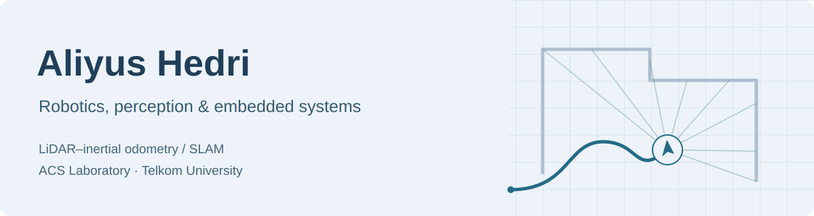

# Hi, I'm Aliyus.

I'm a **Master by Research student in Electrical Engineering** at **Telkom University**, working at **ACS Laboratory**. My current research focuses on **LiDAR–inertial odometry and SLAM**.

I work with **ROS 2, C++, and Python**, with a background in robotics, IoT, and embedded systems.

[Featured projects](#featured-projects) · [Research interests](#research-interests) · [All repositories](https://github.com/aliyushedri?tab=repositories)

## Featured projects

### [YOLO Ground-Truth SLAM](https://github.com/aliyushedri/YOLO_GroundTruthSLAM)

Tools for **fisheye camera calibration, marker generation, and YOLO/marker-based ground-truth pose tracking**.

<b>Explore the calibration and tracking tools</b>

- [ChArUco fisheye calibration](https://github.com/aliyushedri/YOLO_GroundTruthSLAM/blob/main/auto_charuco_fisheye_calibration.py)
- [ArUco robot marker generation](https://github.com/aliyushedri/YOLO_GroundTruthSLAM/blob/main/generate_aruco_a3_robot.py)
- [Floor marker tracking tools](https://github.com/aliyushedri/YOLO_GroundTruthSLAM/tree/main/floor_marker_tracking_windows)

Large experiment artifacts, including recordings, YOLO datasets, tracking results, and model weights, are stored separately from the repository.

### [Markov Chain Simulation for LTE Handover](https://github.com/aliyushedri/Rantai_Markov_Simulation_for_Handover)

A **discrete-time Markov chain simulation for LTE handover analysis**, developed for an Advanced Engineering Mathematics course project. Produces plots and CSV tables for analysis.

**Python · NumPy · pandas · SciPy · Matplotlib**

<b>Explore the simulation and outputs</b>

- [Simulation source](https://github.com/aliyushedri/Rantai_Markov_Simulation_for_Handover/blob/main/1102223047_AliyusHedri_Topik15.py)
- [Datasets](https://github.com/aliyushedri/Rantai_Markov_Simulation_for_Handover/tree/main/dataset)
- [Plots and tables](https://github.com/aliyushedri/Rantai_Markov_Simulation_for_Handover/tree/main/output_topik15)

## Research interests

How can a robot estimate its motion and build a useful map of its surroundings?

<b>LiDAR–inertial odometry & SLAM</b>

My current research area: combining LiDAR and inertial measurements for robot motion estimation and mapping.

I'm interested in how perception algorithms behave when they meet real sensors and physical robots.

<b>Robotics software</b>

ROS 2, C++, and Python are the core tools I use for robotics development and research.

<b>Embedded systems & IoT</b>

My undergraduate background is in electrical engineering, with a focus on robotics, IoT, and embedded systems.

## Tools I work with

| Robotics | Development | Engineering background |
| :--- | :--- | :--- |
| ROS 2 · LiDAR · IMU | C++ · Python | Embedded systems · IoT |

## Find me

**ACS Laboratory · Telkom University**  
[GitHub](https://github.com/aliyushedri)
